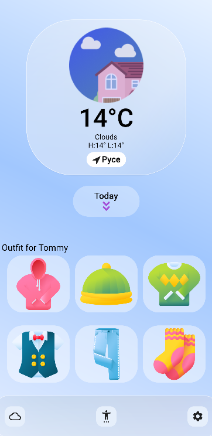

# Flutter Baby Weather App

Flutter app using the [OpenWeatherMap API](https://openweathermap.org/api).
## Supported Features
- [x] Current weather (condition and temperature)
- [x] 5-day weather forecast
- [x] Search by city
## How to configure
- [x] Run flutter pub get
- [x] After that run command flutter run --no-sound-null-safety (project contains package which doen't support null safety)
- [x] If you are using newer version (>3.3.10) run flutter pub upgrade
